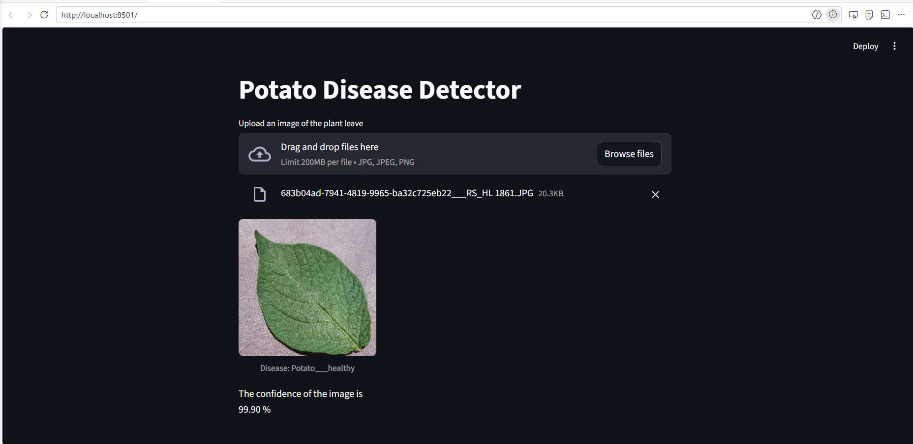
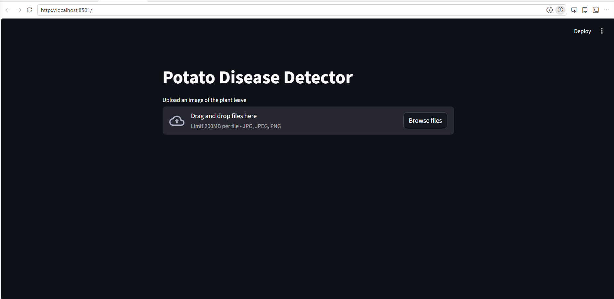

# Potato Disease Detector

Deep learning model that classifies potato leaf images as Early Blight, Late Blight, or Healthy — served via a FastAPI backend with a Streamlit UI.

---

## The problem

Potato diseases cause significant crop losses every season. Early Blight and Late Blight are the two most damaging — but they require expert identification, which most smallholder farmers don't have access to. Early detection means targeted treatment, less chemical use, and less yield loss. This system makes identification instant: photograph a leaf, get a diagnosis.

---

## Demo





---

## Architecture

```
Leaf image
    │
    ▼
Streamlit UI  ──────────────────────────────────────────────────┐
    │                                                            │
    │  (or)                                                      │
    │                                                            ▼
    └──► FastAPI /predict endpoint                        Direct model load
              │                                               │
              ▼                                               │
        PIL → NumPy array                                     │
        expand_dims (add batch dim)                           │
              │                                               │
              └──────────────────────────────────────────────►│
                                                              ▼
                                                 CNN (6× Conv+MaxPool)
                                                 Resize + Rescale
                                                 Data Augmentation
                                                              │
                                                              ▼
                                              Softmax over 3 classes
                                                              │
                                              ┌───────────────┼───────────────┐
                                              ▼               ▼               ▼
                                        Early Blight    Late Blight       Healthy
                                        + confidence    + confidence    + confidence
```

---

## How it works

**Model (`training.ipynb`):**
- Dataset: [PlantVillage](https://www.kaggle.com/datasets/arjuntejaswi/plant-village) — 2,152 images across 3 classes
- Preprocessing pipeline built into the model: resize to 256×256, rescale to [0,1]
- Data augmentation: random horizontal/vertical flip, 20° rotation
- Architecture: 6 stacked Conv2D(64, 3×3, ReLU) + MaxPooling2D(2×2) blocks → Flatten → Dense(64) → Dense(3, Softmax)
- Trained from scratch: 50 epochs, batch size 32, Adam optimizer, GPU (NVIDIA GTX 1650)
- **Test accuracy: 97.62%**

**FastAPI backend (`api/main.py`):**
- `GET /ping` — health check
- `POST /predict` — accepts a multipart image file, converts to numpy array, runs inference, returns `{ class, confidence }`
- Designed to swap out direct model loading for TF Serving (`models.config` included)

**Streamlit UI (`streamlit_potato_dashboard.py`):**
- Supports multiple image upload in one session
- Displays predictions in a 3-column grid — each image captioned with predicted class and confidence %

---

## Tech stack

| Layer | Tool |
|---|---|
| Model | TensorFlow / Keras — custom CNN |
| API | FastAPI + Uvicorn |
| UI | Streamlit |
| Image processing | Pillow, NumPy |
| Dataset | PlantVillage (Kaggle) |
| Model serving (planned) | TensorFlow Serving |

---

## Run it locally

**Prerequisites:** Python 3.8+, TensorFlow 2.x

```bash
git clone https://github.com/huzefa10/potato-disease-detector.git
cd potato-disease-detector
```

**Option 1 — Streamlit UI (simplest):**
```bash
pip install streamlit tensorflow pillow numpy
streamlit run streamlit_potato_dashboard.py
```
Open `http://localhost:8501`, upload one or more leaf images.

**Option 2 — FastAPI backend:**
```bash
pip install -r api/requirements.txt
cd api
uvicorn main:app --reload
```
API available at `http://localhost:8000`. Test with:
```bash
curl -X POST http://localhost:8000/predict \
  -F "file=@path/to/leaf.jpg"
```

---

## Project structure

```
potato-disease-detector/
├── api/
│   ├── main.py                       # FastAPI backend — /ping + /predict
│   └── requirements.txt
├── saved/
│   └── versions/
│       └── 1/
│           └── potato_disease_model.keras   # Trained model
├── streamlit_potato_dashboard.py     # Streamlit UI
├── training.ipynb                    # Full training notebook
└── models.config                     # TF Serving model config
```

---

## Future improvements

- Integrate TF Serving for production-grade model versioning and serving (config already in place)
- Expand to more crop types and diseases (tomato, corn, rice)
- Add Grad-CAM visualisation to show which leaf regions the model focused on
- Deploy backend to cloud (AWS EC2 / GCP) with the Streamlit frontend hitting the live API
- Confidence threshold — flag low-confidence predictions for human review
